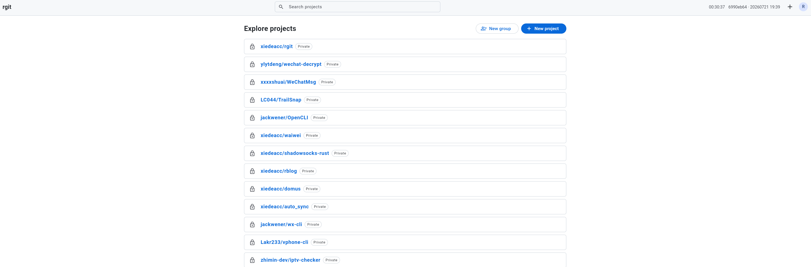
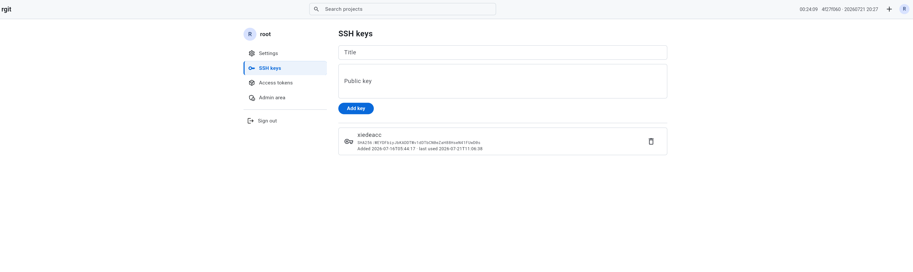

# rgit

面向小团队的轻量级自托管 Git 服务：**Rust 后端 + Flutter Web 前端 + SQLite**，
磁盘存储与 GitLab 兼容（hashed storage / LFS 布局），支持从 GitLab（omnibus
17.11.x）无损迁移。

- HTTPS + SSH 完整 git 协议（clone/fetch/push/submodule/shallow）、Git LFS、
  archive、fork、组与成员权限、PAT、管理面板
- 明确不做：CI、Issue、MR、通知、Redis/PG 等重依赖（见设计文档非目标）
- 部署：单二进制 + nginx 反代，NAS 路径 `/opt/usr/local/rgit/{bin,conf,data,logs}`
- 备份：systemd timer 每小时将 `bin/`、`conf/`、`data/`（不含仓库/LFS）推送到
  `github.com:xiedeacc/rgit_data`

## Preview





## 文档

| 文档 | 内容 |
|---|---|
| [docs/DESIGN.md](docs/DESIGN.md) | 系统设计（架构/库表/协议/鉴权/存储/备份/迁移） |
| [docs/DEPLOY.md](docs/DEPLOY.md) | NAS 部署手册 |
| [docs/MIGRATION.md](docs/MIGRATION.md) | GitLab → rgit 迁移手册 |

## 代码结构

```
crates/rgit           HTTP 服务与 system OpenSSH forced-command 入口
crates/rgit-core      配置 / SQLite / 模型 / 认证 / 权限 / 存储路径
crates/rgit-git       git 子进程封装（协议、仓库管理、只读浏览）
crates/rgit-http      axum：REST API、git smart HTTP、LFS、静态资源
crates/rgit-ssh       system OpenSSH forced-command / rgit-shell 命令校验
crates/rgit-migrate   GitLab PG → SQLite 迁移工具
web/                  Flutter Web（GitHub 风格 UI）
conf/  scripts/       配置样例、备份/恢复/部署脚本
```

## 开发

```bash
cargo check --workspace && cargo test --workspace   # 后端
cd web && flutter analyze && flutter test           # 前端（SDK: /root/src/software/flutter）
cargo run --bin rgit                                # 本地起服务（读 ./rgit.toml）
```
